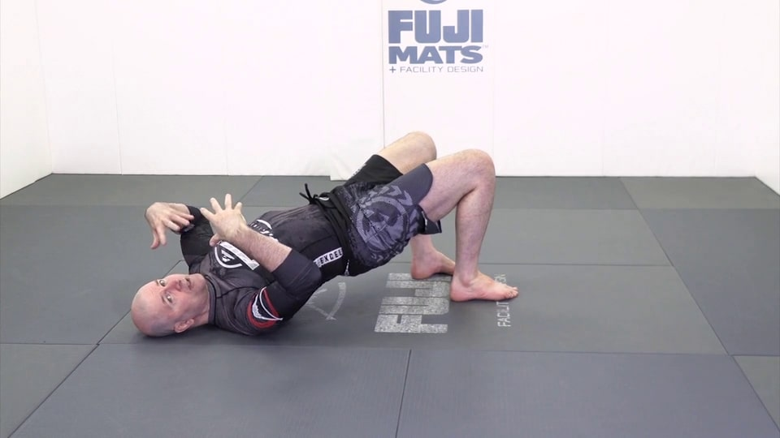
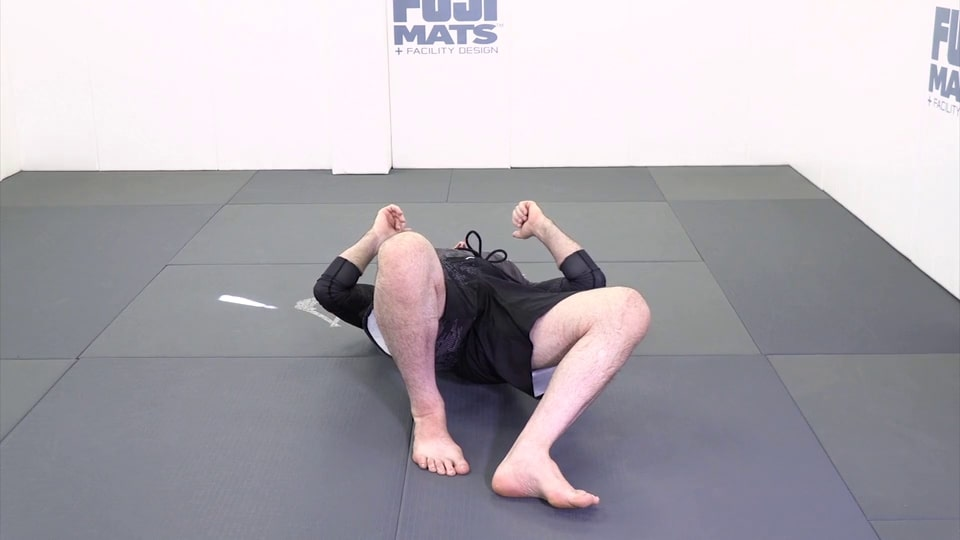
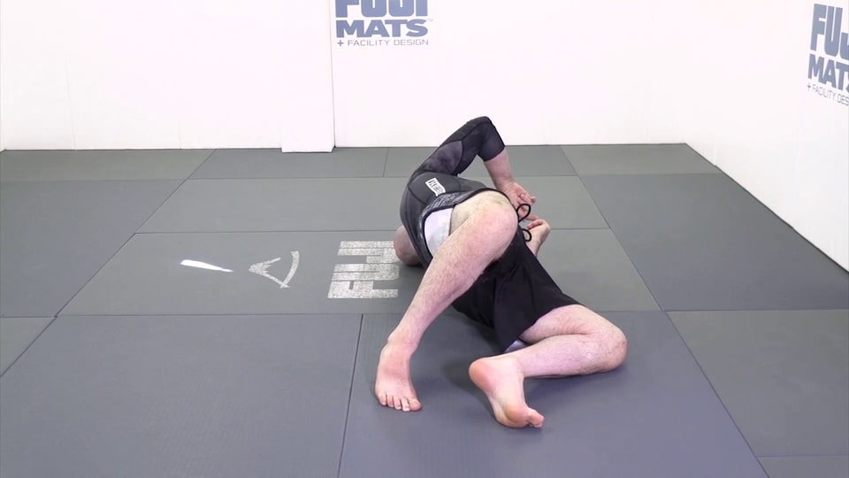
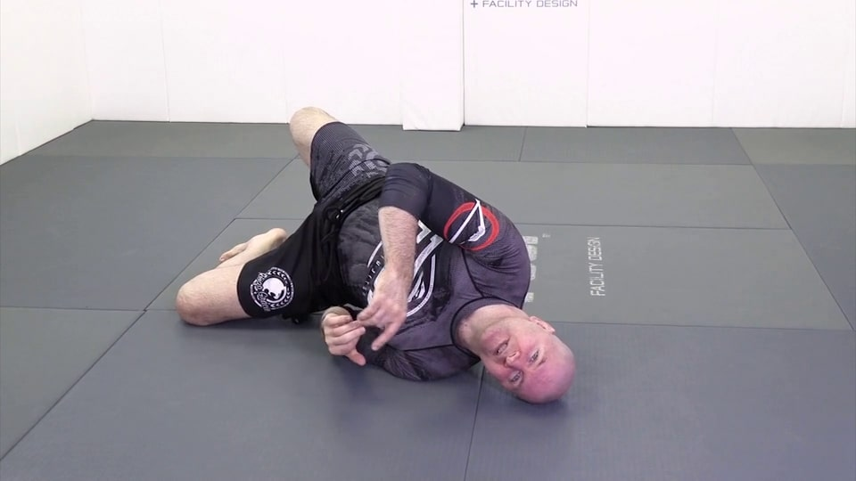
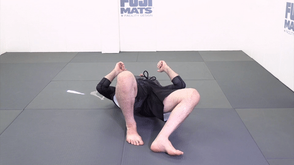
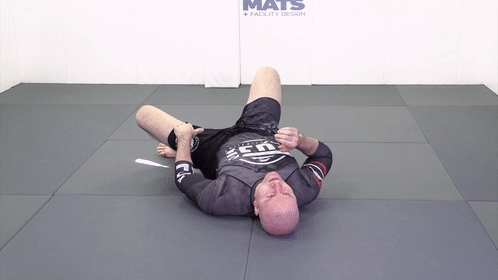

# Джон Данахер. Соло-дриллы

---

## Содержание

- [1. База](#base)
  - [1.1 Мост](#1_1-мост)

---

## 1. База

### 1.1 Мост

 Таз не совсем вверх - мы хотим сместить противника вбок, а не просто поднять высоко вверх

  

Колено в пол, пальцы ноги должны иметь возможность оттолкнуться от пола 

Нас не должно сложить! 
  

  

Голова - смотрим в ту сторону, в которую делаем мост

Не заваливаемся 

Полный вариант правильный

