# Джон Данахер. Соло-дриллы. Краткий конспект.

---

## Содержание

- [1. База](#base)
  - [1.1 Bridge. Мост](#bridge)
  - [1.2 Power shrimp. Силовая Креветка](#power-shrimp)

---

## 1. База

### 1.1 Bridge. Мост

 Таз не совсем вверх - мы хотим сместить противника вбок, а не просто поднять высоко вверх

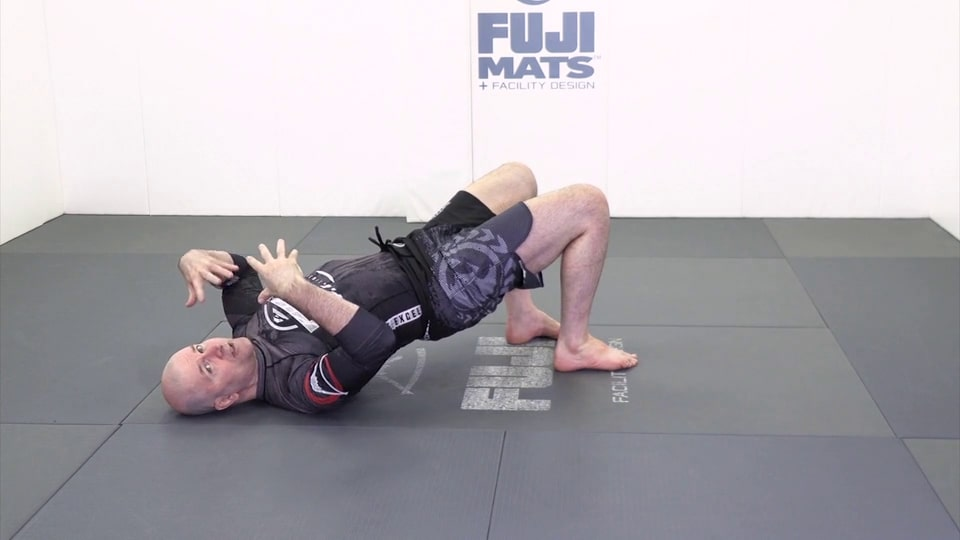

  

Колено в пол, пальцы ноги должны иметь возможность оттолкнуться от пола 

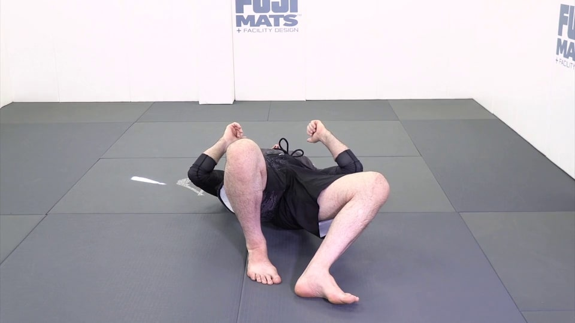

Нас не должно сложить! 
  

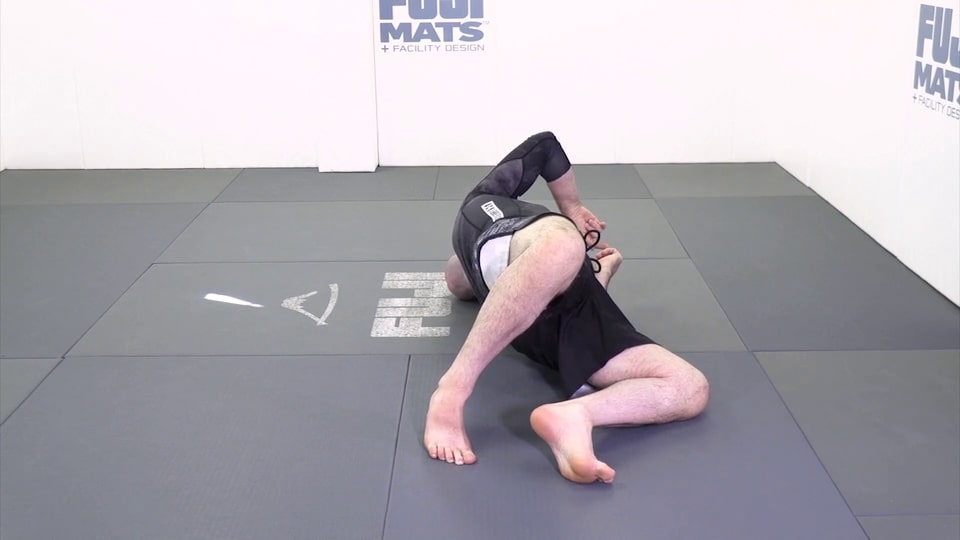

  

Голова - смотрим в ту сторону, в которую делаем мост

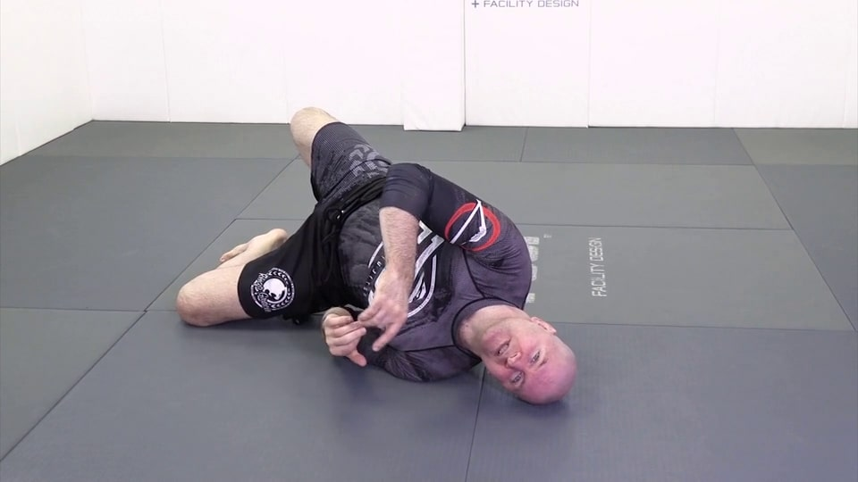

Не заваливаемся 

Полный вариант правильный

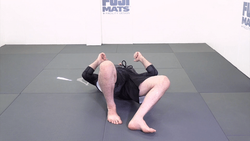
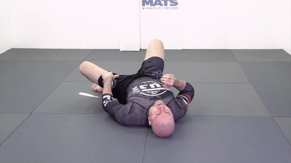

---

### 1.2 Power shrimp. Креветка

  Первое движение очень похоже на мост

  Руки должны складываться вместе - во фрейм 

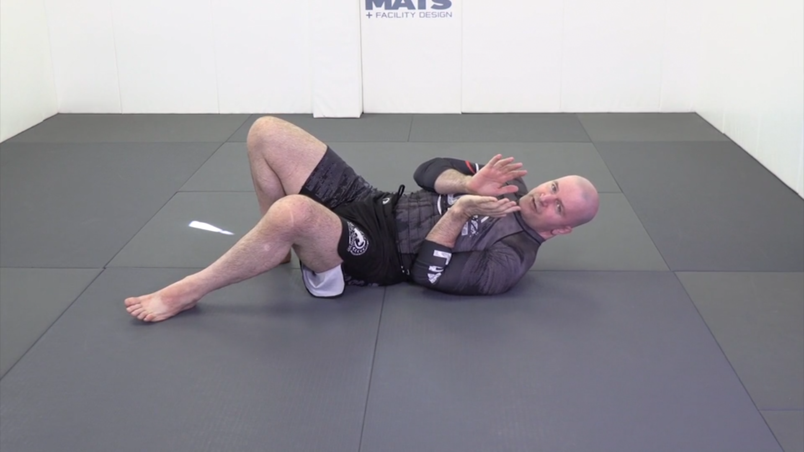

  Вид спереди - следим за ногами. Колено - в пол! Это даёт ему возможность выскользнуть из-под противника 

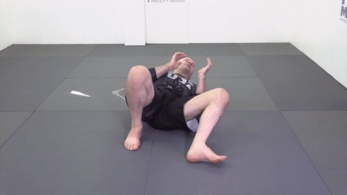

  Пола касаются ступни и плечо - это даёт подвижность 

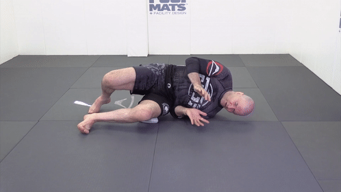

  Не ползать по полу 

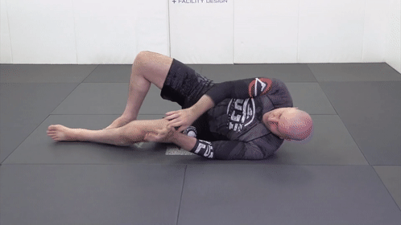

  Хотим добиться пересечения предплечья и нижнего колена (подтягиванем нижней стопы), перейти на другую сторону, потом обратно 

  Вид спереди 

---

### 1.3 Sliding shrimp. Скользящая креветка

Скользим тазом по полу. Мы должны отъехать до уровня наших плеч - внутренний угол между корпусом или ногами ~ 90 градусов. 

Обязательно отставить вернюю стопу в начале движения. Иначе не будет упора. Данахер немного приподнимает таз

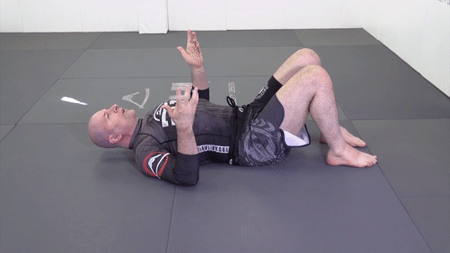

Пример 

