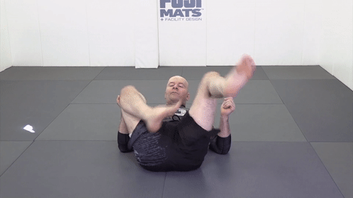
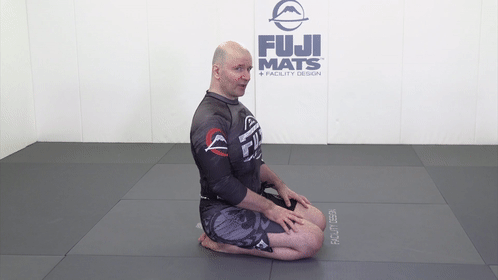

# Джон Данахер. Соло-дриллы. Краткий конспект.

---

---

## Содержание

- [1. Bottom position](#bottom-position)
  - [1.1 Bridge ](#bridge)
  - [1.2 Power shrimp ](#power-shrimp)
  - [1.3 Sliding shrimp ](#sliding-shrimp)
  - [ 1.4. Reverse-shrimp ](#reverse-shrimp)
  - [ 1.5. Scooting ](#scooting)
- [2. Bottom position - continue](#bottom-position-continue)
  - [ 2.1. Supine-heisting ](#supine-heisting)
  - [ 2.2. Hip-heisting ](#hip-heisting)
  - [ 2.3. Legs-pummeling ](#legs-pummeling)
  - [ 2.4. Leg-scissor ](#leg-scissor)
  - [ 2.5. High-leg-spin ](#high-leg-spin)
  - [ 2.6. Sit-out ](#sit-out)
  - [ 2.7. Rolling ](#rolling)
  - [ 2.8. Inside-leg-standup ](#inside-leg-standup)
  - [ 2.9. Sit-back ](#sit-back)
- [3. Top and standing position](#top-and-standing-position)
  - [ 3.1. Guard-standing-up ](#guard-standing-up)
  - [ 3.2. Footwork-drills ](#footwork-drills)
  - [ 3.3. Stance-and-motion ](#stance-and-motion)
  - [ 3.4. Sprawl-and-circle ](#sprawl-and-circle)
  - [ 3.5. Weight-bearing-posture ](#weight-bearing-posture)
- [4. Training](#training)
  - [ 4.1. Spine ](#spine)
  - [ 4.2. Core ](#core)

---

---

<a name="bottom-position"><a>

## 1. Bottom position

<a name="bridge"><a>

### 1.1 Bridge. Мост

 Таз не совсем вверх - мы хотим сместить противника вбок, а не просто поднять высоко вверх

  

Колено в пол, пальцы ноги должны иметь возможность оттолкнуться от пола 

Нас не должно сложить! 
  

  

Голова - смотрим в ту сторону, в которую делаем мост

Не заваливаемся 

Полный вариант правильный

---

### 1.2 Power shrimp. Креветка

  Первое движение очень похоже на мост

  Руки должны складываться вместе - во фрейм 

  Вид спереди - следим за ногами. Колено - в пол! Это даёт ему возможность выскользнуть из-под противника 

  Пола касаются ступни и плечо - это даёт подвижность 

  Не ползать по полу 

  Хотим добиться пересечения предплечья и нижнего колена (подтягиванем нижней стопы), перейти на другую сторону, потом обратно 

---

### 1.3 Sliding shrimp. Скользящая креветка

Скользим тазом по полу. Мы должны отъехать до уровня наших плеч - внутренний угол между корпусом или ногами ~ 90 градусов. 

Обязательно отставить вернюю стопу в начале движения. Иначе не будет упора. Данахер немного приподнимает таз

Пример 

---

### 1.3 Reverse shrimp. Обратная креветка

Подтягиваем таз к стопе 

---

### 1.4 Scooting. Бегство?

Вперёд - всегда на одной руке. Упираемся в стопу и ногу, бросаем таз вперёд 

Назад можно на одной руке и на двух. На двух быстрее, но нет второй руки для защиты 

Между рукой и коленом - рамка, чтобы противник не залетел на болевой на руку 

---

<a name="bottom-position-continue"><a>

## 2. Bottom position - continue

### 2.1 Supine heisting. Подъём из положения лёжа на спине

Креветимся, когда на боку - крестим ноги, подтягиваем ноги - можем выходить в другую позицию 

Когда на боку - мы собраны - иначе очень тяжело перевернуться 

Фронтальный вид - нога рядом с тазом, упирается в пол. После креветки корпус собран 

После поворота верхнее плечо над нижний - не разваливаемся. Меняем ноги, нижняя нога активно (чтобы не распластяться) толкается от матов 

---

### 2.2 Hip heisting. Подъём с бедра (тех.вставание)

Принцип работы ног 

Положение корпуса, рук, ног 

Грудная клетка смотрит вниз, иначе легко завалиться назад 

Встаём 

---

### 2.3 Вертим тазом/ногами

Пример 

Ступни, колени, бёдра - задействовано всё. Пример ленивого и более агрессивного движения 

Фронтальный вид - обратное движение 

---

### 2.4 Leg scissor. Ножницы ногами

Пример. Добавить примеры восстановления из гарда

---

### 2.5 High leg spin. Разворот ногами

Пример. Касаемся сзади плечей матов одной ногой, второе колено проходит под ней, восстанавливаем гард. В идеале развернуться на 180 градусов 

Мы собраны, спина круглая, иначе сложно перевернуться 

Одна нога тянется к матам - не нужно двумя 

---

### 2.6 Sit out. Высед

Пример. Голова вверх, грудь - вперёд 

Не терять равновесиe 

---

### 2.7 Rolling. Роллиг

На одном плече 

Granby-roll 

Forward-roll. В идеале - прямые ноги 

Полный набор 

---

### 2.8 Inside leg stanup

Не встаём на противника двумя фронтальными ногами - нас могут опрокинуть 

Пример с оппонентов 

---

### 2.9 !!!Отсутствует описание - добавить

---

## Top and standing position

---

<a name="top-and-standing-position"><a>

## 3. Top and standing position

### 3.1 Guard standing up

Встаём - вид сзади. Идея в том, чтобы ступни не оказались рядом

Не заваливаемся вперёд - спина прямая, ноги пружинят 

Руки идут вдоль коленей 

---

### 3.2 Footwork drills

Медленно. Нога в сторону, бэк стэп, одновременно продёргиваем ноги оппонента. Занимаем положение сбоку от оппонента 

Ролл 

Обходим в 3 шага 

---

### 3.3 Stance and motion. Стойка и движение

Внимательно смотрим за движениями - стойка всегда меняется - нижняя, верхняя, фронтальная. Ноги, руки (защита). 

---

### 3.4 sprawl and circle. Спролл в движении

Внимательно смотрим за движениями - стойка всегда меняется - нижняя, верхняя, фронтальная. Ноги, руки (защита). 

---

### 3.5 Weight bearing posture

---

<a name="training"><a>

## 4. Training

---

### 4.1 Spine. Позвоночник

Сгибаем-разгибаем позвоночник 

Круг на плечах 

Круг без рук 

Катаемся на спине 

Соединяем с кругом на плечах/шее 

Продвинутый мост - переходим под углом 90 в обе стороны 

Делаем мост без перерыва 

Ошибка - не доводить мост до конца 

Качаем шею 

---

### 4.2 Building core strength for jiu jitsu. Корпус

Ходим - локти вместе с коленями 

Cruxifix-roll 

